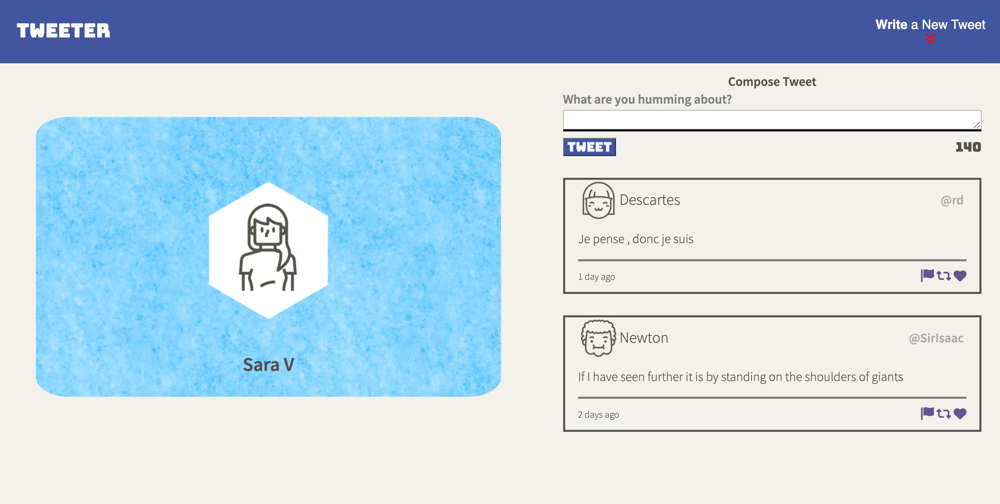
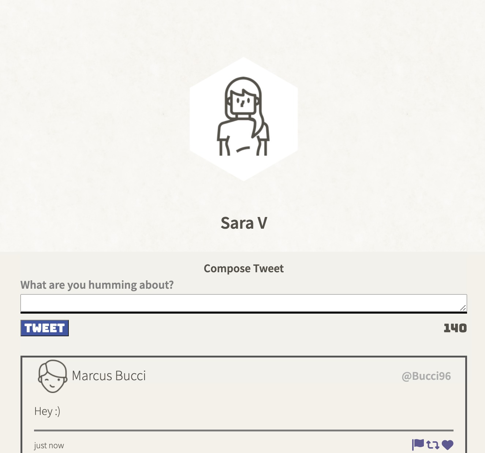

# Tweeter Project

Tweeter is a simple, single-page Twitter clone.

Using a template from LighthouseLabs HTML, CSS, JS, jQuery and AJAX front-end skills, and their Node, Express back-end skills were practiced.

## Getting Started

1. Install dependencies using the `npm install` command.
2. Start the web server using the `npm run local` command. The app will be served at <http://localhost:8080/>.
3. Go to <http://localhost:8080/> in your browser.

## Page Layout

## Posting a Tweet

## Responsive Design View

## Dependencies

- body-parser
- chance
- md5
- express
- timeago.js
- Express
- Node 5.10.x or above
